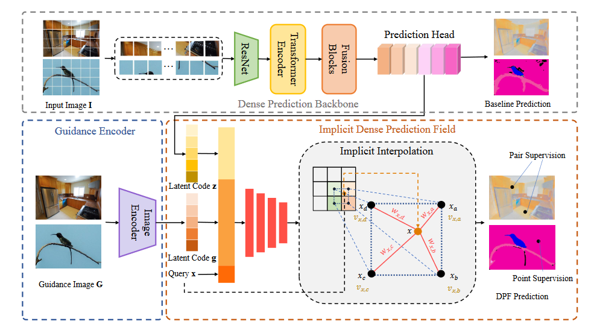

# DPF: Learning Dense Prediction Fields with Weak Supervision

Paper Accepted to CVPR 2023.

## Introduction

Nowadays, many visual scene understanding problems are addressed by dense prediction networks. But pixel-wise dense annotations are very expensive (e.g., for scene parsing) or impossible (e.g., for intrinsic image decomposition), motivating us to leverage cheap point-level weak supervision. However, existing pointly-supervised methods still use the same architecture designed for full supervision. In stark contrast to them, we propose a new paradigm that makes predictions for point coordinate queries, as inspired by the recent success of implicit representations, like distance or radiance fields. As such, the method is named as dense prediction fields (DPFs). DPFs generate expressive intermediate features for continuous sub-pixel locations, thus allowing outputs of an arbitrary resolution. DPFs are naturally compatible with point-level supervision. We showcase the effectiveness of DPFs using two substantially different tasks: high-level semantic parsing and low-level intrinsic image decomposition. In these two cases, supervision comes in the form of single-point semantic category and two-point relative reflectance, respectively. As benchmarked by three large-scale public datasets PascalContext, ADE20k and IIW, DPFs set new state-of-the-art performance on all of them with significant margins.

## Installation

### Requirements
    
    torch==1.8.1
    torchvision==0.9.1
    opencv-python==4.5.2
    timm==0.5.4

### Data preparation

#### Scene Parsing
Download PascalContext from [HERE](https://drive.google.com/file/d/13zPUAlmMrwWcDUNqO2CWyFQi28zxgf3J/view?usp=sharing). 

Download ADE20k from
[HERE](https://drive.google.com/file/d/1dV7C3Jc1lKIfWrj0_0KDw3rO04mV6aA1/view?usp=sharing).

Unzip them and the folder should have the following hierarchy:

    dataset_path
    └───PASCALContext
    |     └───    train(images for training)  
                   |   trainnpy(labels for training with full supervision)
                   |   val(images for validation)
                   |   valnpy(labels for validation)
                   |   Point_Annotation(labels for training with point-supervision)
                   |   info.json
                   |   ...
    └───ade20k
    |     └───    train(images for training)  
                   |   trainnpy(labels for training with full supervision)
                   |   val(images for validation)
                   |   valnpy(labels for validation)
                   |   Point_Annotation(labels for training with point-supervision)
                   |   info.json
                   |   ...

#### Intrinsic Decomposition

Download iiw dataset from [HERE](labelmaterial.s3.amazonaws.com/release/iiw_dataset-release-0.zip). Unzip it directly and merge it with the current ++iiw_dataset++ folder.

## Pretrained model

You can download corresponding pre-trained models from [ADE20K](https://drive.google.com/file/d/1RAFiofKlSo3w-R4Jn8P8HrZWwIX2y5Bk/view?usp=share_link) ,[PASCALContext](https://drive.google.com/file/d/1LiVHAPRzlhc4owsx_y7sS92HDXbqmbXH/view?usp=share_link) and [IIW](https://drive.google.com/file/d/1EYX5nHDbTYsTMRiDHSiLEvV6jTrKhfC4/view?usp=share_link).

## Training and evaluating

#### Scene Parsing 
To train a DPF on PascalContext or ADE20k with four GPUs:

    CUDA_VISIBLE_DEVICES=0,1,2,3 \
    python -m torch.distributed.launch --nproc_per_node=4 --nnodes=1 --node_rank=0 --master_port=27916 main.py train \
    --data-dir {your_data_path} \
    --crop-size 512 \
    --batch-size 2 \
    --random-scale 2 \
    --random-rotate 10 \
    --epochs 120 \
    --lr 0.028 \
    --momentum 0.9 \
    --lr-mode poly \
    --train_data [PASCAL/ade20k] \
    --workers 12 

To test the trained model with its checkpoint:

    
    CUDA_VISIBLE_DEVICES=0 python main.py test \
    -d {your_data_path} \
    -s 512 \
    --resume [model path] \
    --phase test \
    --batch-size 1 \
    --ms \
    --workers 10 \
    --train_data [PASCAL/ade20k]

#### Intrinsic Decomposition
To train a DPF on IIW with a single GPU:

    CUDA_VISIBLE_DEVICES=0 python main_iiw.py  -d  [iiw dataset path]  --ms -s 512 --batch-size 2 --random-scale 2 --random-rotate 10 --epochs 30 --lr 0.007 --momentum 0.9 --lr-mode poly --workers 12  -c 1 -g 512
    
To test the trained model with its checkpoint:

    CUDA_VISIBLE_DEVICES=0 python main_iiw.py  -d  [iiw dataset path]  --ms -s 512 --batch-size 2 --random-scale 2 --random-rotate 10 --epochs 30 --lr 0.007 --momentum 0.9 --lr-mode poly --workers 12  -c 1 -e --resume [model path] -g 512

